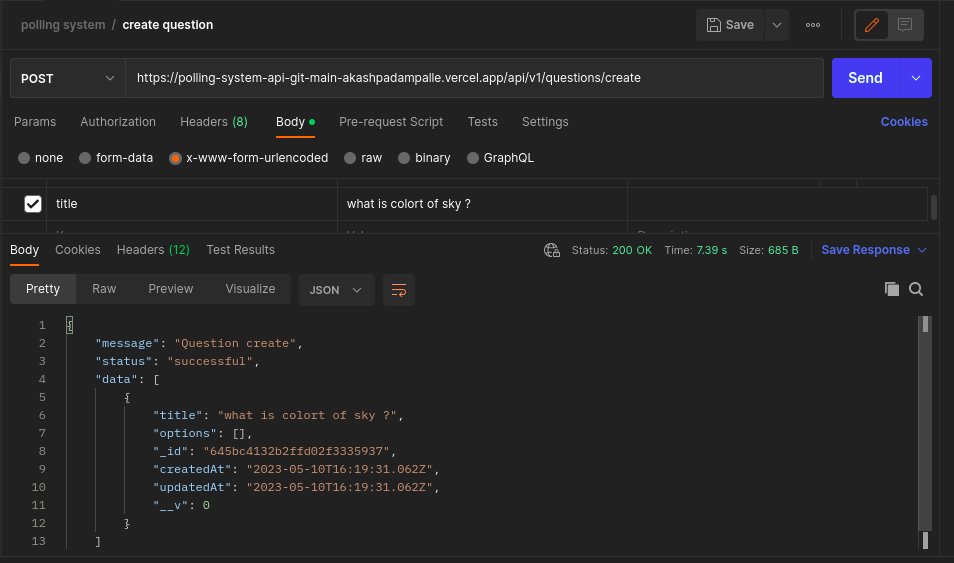

# Polling System API

A polling system API is an application programming interface that allows developers to create, manage, and retrieve data from a polling system. A polling system is a platform that enables users to create polls, surveys, and quizzes and gather responses from participants.

## Tech Stack

**Server:** Node
, Express
, mongoose

## Project live link

base-url 👉 https://gentle-stockings-fly.cyclic.app/

## API Reference

#### Create a Question/Survey/Poll

```http
  POST /questions/create
```

| Parameter | Type     | Description                      |
| :-------- | :------- | :------------------------------- |
| `title`   | `string` | **Required**. to create question |



#### Get Question details

```http
  GET /questions/${id}
```

| Parameter | Type     | Description                           |
| :-------- | :------- | :------------------------------------ |
| `id`      | `string` | **Required**. Id of question to fetch |


#### Create options to the Question

```http
  POST /questions/${id}/options/create
```

| Parameter | Type     | Description                           |
| :-------- | :------- | :------------------------------------ |
| `id`      | `string` | **Required**. Id of question to fetch |
| `text`    | `string` | **Required**. to create option        |


#### Add vote to the option

```http
  GET /options/${id}/add_vote
```

| Parameter | Type     | Description                            |
| :-------- | :------- | :------------------------------------- |
| `id`      | `string` | **Required**. Id of option to add vote |


#### Delete options

```http
  DELETE /options/${id}/delete
```

| Parameter | Type     | Description                          |
| :-------- | :------- | :----------------------------------- |
| `id`      | `string` | **Required**. Id of option to delete |


#### Delete question

```http
  DELETE /questions/${id}/delete
```

| Parameter | Type     | Description                            |
| :-------- | :------- | :------------------------------------- |
| `id`      | `string` | **Required**. Id of question to delete |


